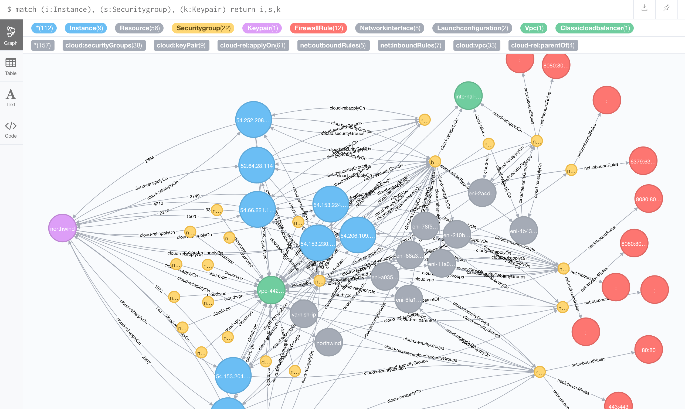
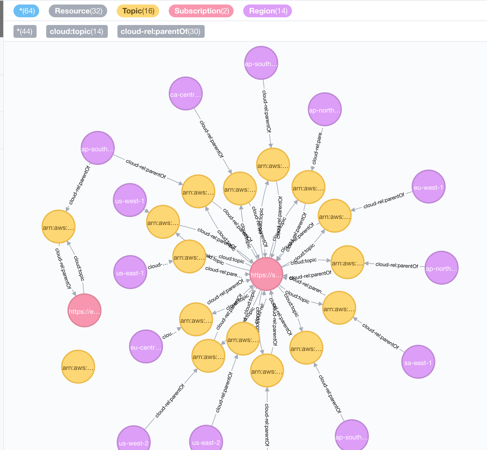
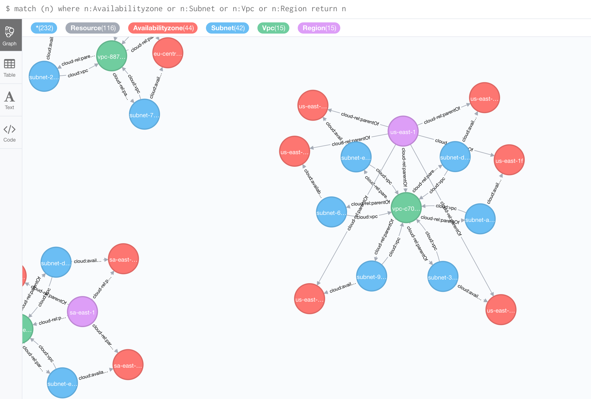

# AWS Infra Map
Load your AWS environment into neo4j db

Example usage:

```
docker run 
    -d \
    --name neo4j_awless \
    --env NEO4J_AUTH=$NEO4J_AUTH \
    --env AWS_TO_NEO4J_LIMIT_REGION=ap-southeast-2  \
    --env AWS_SECRET_ACCESS_KEY=$AWS_SECRET_ACCESS_KEY \
    --env AWS_ACCESS_KEY_ID=$AWS_ACCESS_KEY_ID \
    --env AWS_SESSION_TOKEN=$AWS_SESSION_TOKEN \
    --env AWS_DEFAULT_REGION=$AWS_DEFAULT_REGION \
    -p 80:7474 \
    -p 7687:7687 \
    aws_infra_map
```

NEO4J_AUTH has format user/pass
and sets initial admin creds for neo4j

# Example screenshots




